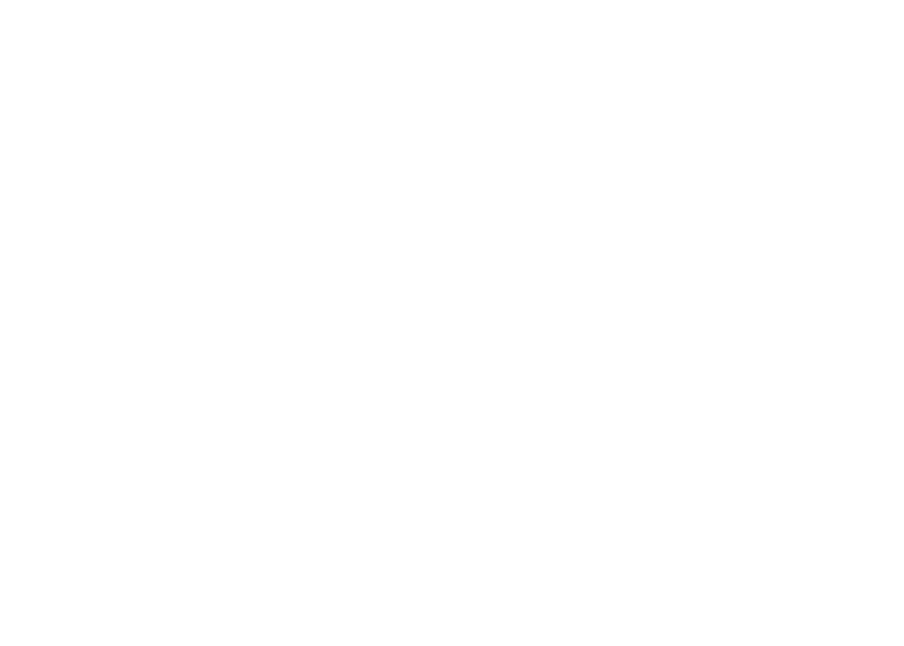

# Genesis – Agence de Communication Créative

<p align="center">
  
</p>

<p align="center">
  <a href="https://github.com/Juan-Lucas/genesiswebsite/actions">
    
  </a>
  <br>
  <sub>Voir les workflows CI sur GitHub Actions</sub>
</p>

## Présentation

**Genesis** est une agence de communication créative spécialisée dans la conception de solutions digitales innovantes. Notre site officiel présente nos services, nos réalisations et notre équipe, avec un design moderne, responsive et optimisé pour le digital.

## Nos Services

- Stratégie de communication digitale
- Création de sites web & applications sur-mesure
- Identité visuelle & branding
- Gestion des réseaux sociaux
- Production de contenus créatifs (photo, vidéo, rédaction)
- Conseil & accompagnement digital

## Brochure PDF

Le site permet de télécharger une brochure professionnelle au format PDF présentant Genesis, ses services et ses valeurs. 

### Fonctionnalités
- Génération dynamique de PDF avec DomPDF
- Design professionnel et branding Genesis
- Contenu complet : présentation, services, statistiques, valeurs et contact
- Accessible depuis la page "À propos" et le footer du site

### Utilisation
- **Depuis la page À propos** : Un bouton de téléchargement est disponible dans la section "Notre Histoire"
- **Depuis le footer** : Lien "Télécharger la brochure" dans la section Contact (accessible sur toutes les pages)
- **URL directe** : `/brochure/download`

La brochure est générée à la volée et nommée automatiquement `Genesis-Brochure-YYYY.pdf` avec l'année en cours.

## Projets

Découvrez quelques-unes de nos réalisations dans la section dédiée du site. Chaque projet est pensé pour répondre aux besoins spécifiques de nos clients, en alliant créativité, performance et expérience utilisateur.

## L’Équipe

Notre équipe pluridisciplinaire rassemble des experts passionnés par le design, le développement web, la communication et le marketing digital. Nous croyons en la force du collectif pour imaginer et concrétiser des projets ambitieux.

## Technologies

Ce site est développé avec [Laravel](https://laravel.com), un framework PHP moderne et robuste, et utilise les dernières technologies web pour garantir performance, sécurité et évolutivité.

## Installation & Développement

1. **Cloner le dépôt :**
   ```bash
   git clone https://github.com/Juan-Lucas/genesiswebsite.git
   cd genesiswebsite
   ```

2. **Installer les dépendances PHP et JS :**
   ```bash
   composer install
   npm install
   ```

3. **Configurer l’environnement :**
   ```bash
   cp .env.example .env
   php artisan key:generate
   ```

4. **Lancer les migrations (optionnel) :**
   ```bash
   php artisan migrate
   ```

5. **Démarrer le serveur de développement :**
   ```bash
   php artisan serve
   ```

6. **Compiler les assets :**
   ```bash
   npm run dev
   ```

## Tests & Qualité

- Lint PHP avec [Laravel Pint](https://laravel.com/docs/10.x/pint)
- Tests automatisés avec [Pest](https://pestphp.com/) ou PHPUnit
- Intégration continue via GitHub Actions

## Contribution

Les contributions sont les bienvenues ! Merci de consulter le guide de contribution et de respecter le code de conduite du projet.

## Licence

Ce projet est open-source sous licence [MIT](https://opensource.org/licenses/MIT).

---

> Site web officiel de Genesis, agence de communication créative. Présentation de nos services, projets et équipe, avec un design moderne, responsive et optimisé pour le digital.
